# ChequeCheck (CC) - Приложение для ОС Аврора

## Описание

ChequeCheck (CC) - это приложение для мобильной операционной системы Аврора, разработанное на Flutter с помощью AvroraSDK , которое помогает пользователям контролировать свои финансы, анализировать доходы и расходы, а также прогнозировать изменения баланса. Приложение предназначено для различных категорий пользователей, от обычных людей до индивидуальных предпринимателей и фирм.

## Функциональность

*   **Подсчёт баланса(ов):** Отслеживание текущего баланса пользователя на основе всех доступных финансовых данных.

*   **Учёт регулярных доходов/расходов:** Автоматическое включение в расчёты повторяющихся доходов и расходов (зарплата, аренда, коммунальные платежи и т.д.).

*   **Конвертация:** Пересчёт баланса в различные активы:
    *   Продукты (потребительская корзина).
    *   Акции.
    *   Валюту.

*   **Оценка имущества:** Учёт стоимости имущества пользователя при расчёте общего баланса.

*  **Прогноз изменения баланса:** Прогнозирование изменений баланса на основе:
    *   Инфляции.
    *   Кредитов, рассрочек и ипотек.
    *   Депозитов.
    *   Налогов.
    *   Прочих факторов (например, "космическое излучение" - для расширенного моделирования рисков, шутка, но можно добавить).

*   **Графики и диаграммы:**
    *   График изменения баланса во времени (с режимами учёта инфляции и прогноза).
    *   Диаграммы расходов/доходов по группам (регулярные/нет, зарплата/дивиденты/проценты/прибыль и т.п.).

*   **Общий доступ:** Возможность предоставления общего доступа к финансовым данным для групп пользователей (например, для семейного бюджета или для сотрудников фирмы).

*   **Режимы для разных категорий пользователей:**
    *   Обыватели: Упрощённый интерфейс с базовыми функциями.
    *   ИП: Расширенный функционал для учёта доходов и расходов в рамках индивидуального предпринимательства.
    *   Фирмы: Наиболее полный функционал для ведения финансового учёта компании.

## Команда разработчиков

•  https://github.com/Iuvennis
•  https://github.com/rumkira20ist1
•  https://github.com/SmilingKitty
•  https://github.com/DarkyDent

## Технологии
•   **AvroraSDK** Плагин для разработки приложения для ОС Аврора.
•   **Flutter:** Кросс-платформенный фреймворк для разработки пользовательского интерфейса.
•   **Dart:** Язык программирования, используемый во Flutter.

### Галерея:
---

| 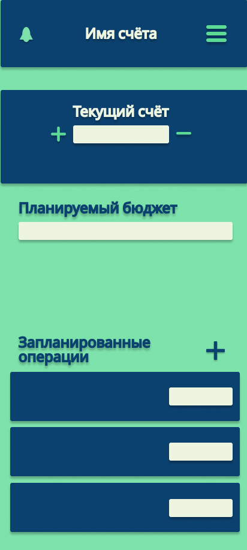 | 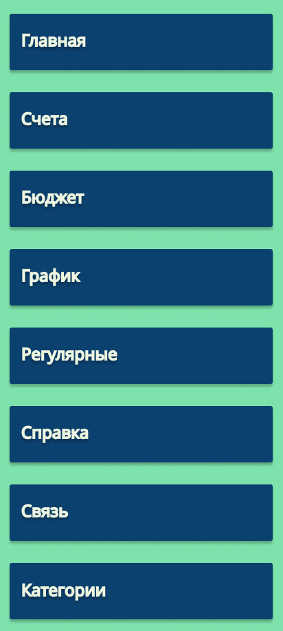 |
|:-------------------:|:-------------------:|

| 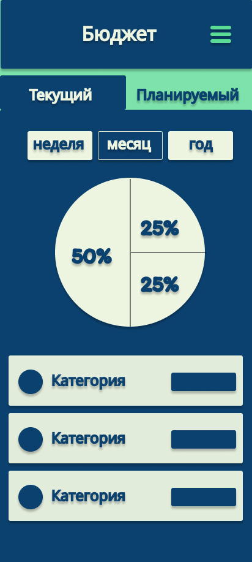 | 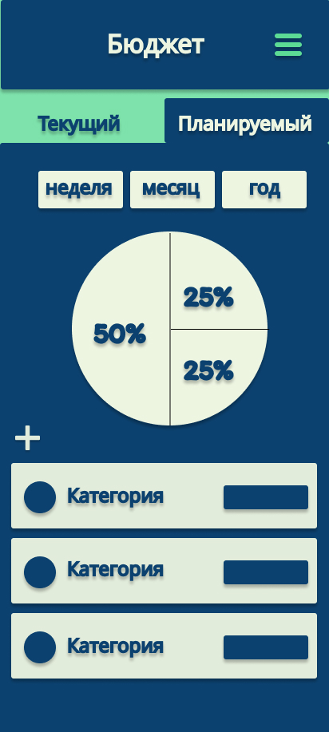 |
|:-------------------:|:-------------------:|

| 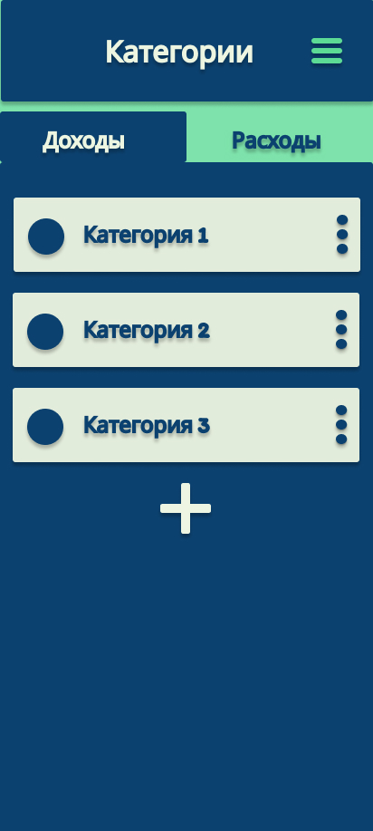 | 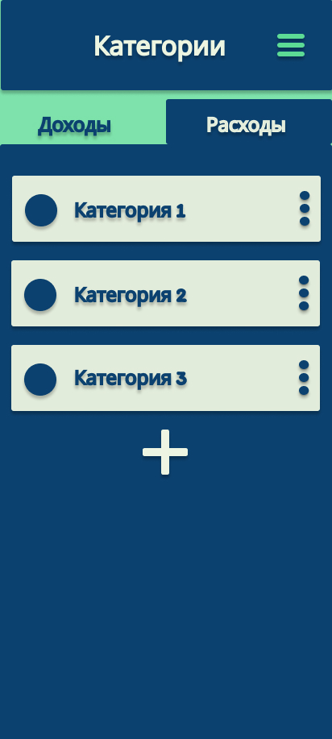 |
|:-------------------:|:-------------------:|

| 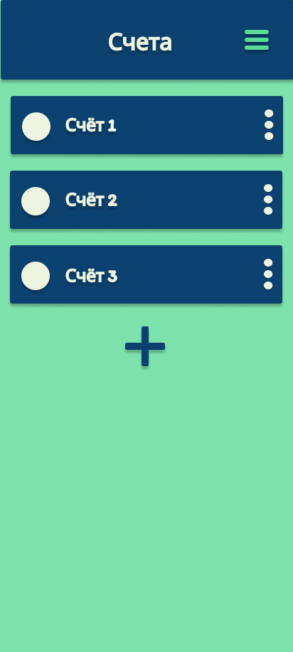 | 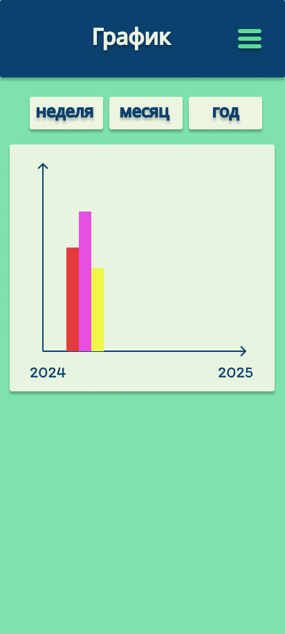 |
|:-------------------:|:-------------------:|

| 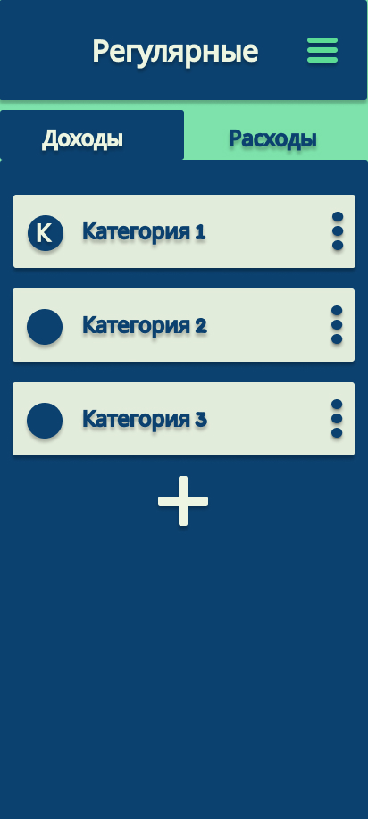 | 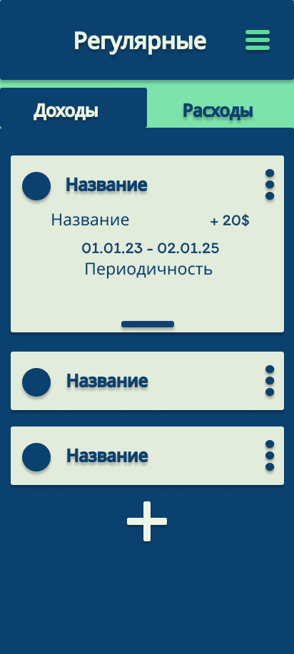 |
|:-------------------:|:-------------------:|

|  | 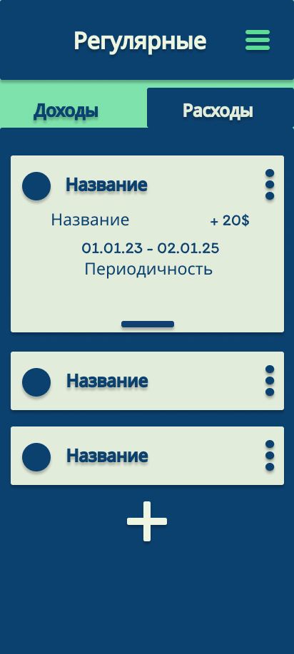 |
|:-------------------:|:-------------------:|

